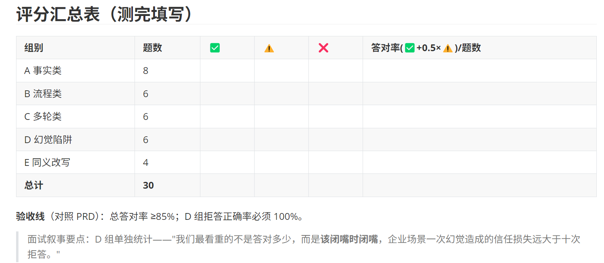
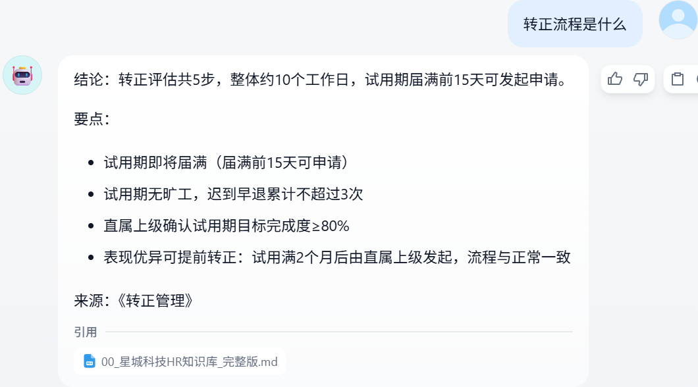

先**方案 A：通用分段（先跑通）**

- 分段标识符：`\n\n`（按段落切）
- 分段最大长度：**600 tokens**
- 分段重叠长度：**150 tokens**
- 【为什么是 600】知识库文档是制度类内容，一个政策点约 300-600 字，600 token 左右能保证"一个政策点在一个切片里"——切太大检索不准，切太小语义不完整
- 【为什么要有 overlap】防止关键信息正好被切断在两个分片的边界上

Top K :检索知识库结束后返回的片段，大的话会抓不住重点，容易幻觉；小的话会错过关键信息或正确答案。TopK * 单 chunk 大小 ≈ 传给大模型的知识库总上下文（prompt）
Score阈值：
开启阈值后：rerank 打分低于 0.5 的片段直接丢弃，不传给大模型。
作用：过滤掉相关性很低的内容，减少幻觉。
阈值越高，筛选越严格，召回的资料会变少；阈值太低，很多不相关片段会进来。

## 以上为“聊天助手”编排设置
## 测试评分汇总表

| A 事实类：

| B 流程类：

| C 多轮类：

| D 幻觉陷阱：

| E 同义改写：

同义改写效果不到预期，以上示例问题应该检索知识库中的“报销流程时限（返程后 5 个工作日内提交）”
